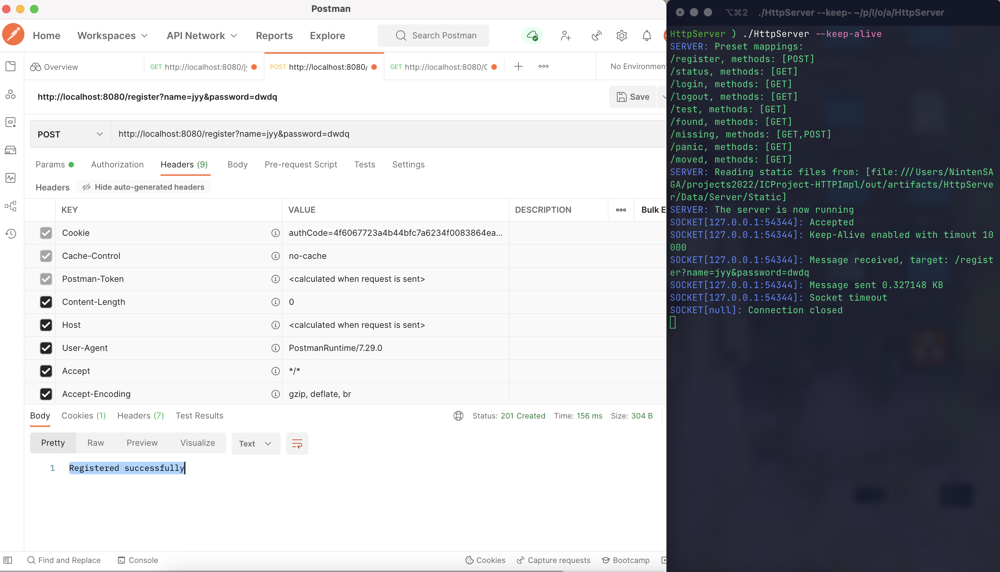

# HTTP Client/Server for Java


由 Java Socket API 实现的简单 HTTP Client 与 Http Server

## TODO

- [x] 语言
- [x] 程序运行方式
- [ ] 功能点
  - [ ] 说明、运行截图
- [ ] 关键数据结构、类说明
  - [ ] 名字与对应功能

# 1. 概览

## 1.1 环境

本项目基于 JDK 17.0 编写，由 Maven 构造。

## 1.2 依赖

| Scope | GroupId             | ArtifactId             | Version    |
| ----- | ------------------- | ---------------------- | ---------- |
| Build | `org.projectlombok` | `lombok`               | `1.18.22`  |
| Build | `org.json`          | `json`                 | `20220320` |
| Test  | `org.junit.jupiter` | `junit-jupiter-engine` | `5.8.2`    |

## 1.3 运行方式

最终产品为 jar 文件，通过 `java -jar [NAME].jar` 运行。

# 2. 使用

## 2.1 外部文件

[Data](./Data/) 及其子目录会在 HttpClient 或 HttpServer 启动时被自动创建于 jar 文件所在目录，结构如下：

```
Data
├── Client
│   └── Cache   // Client的缓存目录
└── Server
    ├── Cache   // Server的缓存目录（未使用）
    └── Static  // Server的静态文件存放目录
```

## 2.2 HttpServer

## 2.2.1 执行指令

`java -jar /path/to/HttpServer.jar [OPTIONS]...`

## 2.2.2 具体语法

```
SYNOPSIS
    ~   [-p <PORT>] [--keep-alive]
        [-t <TIMEOUT>]

OPTIONS
    -p <PORT>       Set up the server with the specified port number.
                    The default value is 8080

    --keep-alive    Enable keep-alive.

    -t <TIMEOUT>    Socket timeout.
                    The default value is 10000
```

## 2.2.3 启动信息

若运行正常，则会显示启动信息，包含：

- Server 运行日志
- 预设 URL Mapping 信息
- 静态文件读取目录

如下所示：

```
SERVER: Preset mappings:
/register, methods: [POST]
/status, methods: [GET]
/login, methods: [GET]
/logout, methods: [GET]
/test, methods: [GET]
/missing, methods: [GET,POST]
/moved, methods: [GET]
SERVER: Reading static files from: [file:///.../Data/Server/Static]
SERVER: The server is now running
```

## 2.3 HttpClient

## 2.3.1 执行指令

`java -jar /path/to/HttpClient.jar <URL> [OPTIONS]...`

## 2.3.2 具体语法

```
SYNOPSIS
    ~   <URL>
        [-m <METHOD>] [--keep-alive] [-b <text>]
        [-h <headers>...]

URL
    Using the generic URI syntax of:
    http://<HOSTNAME>[:PORT][/PATH][?QUERY]

    The default value of the port number is 80.
    Only support HTTP protocol (not HTTPS).

OPTIONS
    -m <METHOD>     Send with the specified web method.
                    Only supports GET and POST.
                    The default value is GET.

    --keep-alive    Enable keep-alive.ß

    -b <text>       Plain text body.

    -h <header>...  Send with the specified headers.
                    Syntax: <key>:<value>
                    e.g.: User-Agent:AbaAba/0.1
```

## 2.3.3 执行信息

若执行正常，则会显示

- Client 执行日志
- HTTP Request Message 原信息
- HTTP Response Message 原信息

其中原信息包含：

- Startline
- Headers
- Body
  - 若为 `text/plain` 则直接显示
  - 否则存储在[缓存目录](./Data/Client/Cache/)中，显示文件路径

如下所示：

```
/* 直接显示 Body 内容 */

CLIENT: Client has connect to the host
SOCKET[localhost127.0.0.1:8080]: Message sent 0.097656 KB

>> ==================== HTTP Request Message ==================== <<
>> GET /test HTTP/1.1
>> Accept: */*
>> User-Agent: Wget/1.21.3
>> Host: localhost
>> Accept-Encoding: gzip
>>
CLIENT: Status code received: 200
CLIENT: Handle returned directly...
CLIENT: Request complete

<< ==================== HTTP Response Message ==================== >>
<< HTTP/1.1 200 OK
<< date: Tue, 24 May 2022 03:54:16 GMT
<< server: nju_ic
<< content-encoding: gzip
<< connection: keep-alive
<< content-type: text/plain; charset=UTF-8
<<
<< You got the place!!!
```

```
/* 显示 Body 存储路径 */

>> ==================== HTTP Request Message ==================== <<
>> GET /OS/2022/ HTTP/1.1
>> Accept: */*
>> User-Agent: Wget/1.21.3
>> If-Modified-Since: Sun, 22 May 2022 11:13:51 GMT
>> Host: jyywiki.cn
>> Accept-Encoding: gzip
>>
CLIENT: Status code received: 200
CLIENT: Handle returned directly...
CLIENT: Request complete

<< ==================== HTTP Response Message ==================== >>
<< HTTP/1.1 200 OK
<< date: Tue, 24 May 2022 03:56:37 GMT
<< server: nginx/1.18.0 (Ubuntu)
<< content-encoding: gzip
<< content-type: text/html; charset=utf-8
<< connection: keep-alive
<< Content-Length: 16876
<<
<< Body saved at:
<< file:///.../Data/Client/Cache/jyywiki.cn/OS/2022/index/cache.html
```

# 3. 功能

## 3.1 HttpServer

HttpServer 采用 Java NIO.2 模型进行开发，使用了 `java.nio.channels.AsynchronousServerSocketChannel`、`java.nio.channels.AsynchronousSocketChannel` 等类。

### 3.1.1 接收

#### 3.1.1.1 支持 `GET` 和 `POST` 请求

相关测试: [LoginSystemTests](./src/test/java/loginsystemtests/LoginSystemTests.java)

 

#### 3.1.1.2 支持以下状态码：

- 200 OK<br/>

  
- 301 Moved Permanently<br/>


- 302 Found<br/>


- 304 Not Modified<br/>


- 404 Not Found<br/>


- 405 Method Not Allowed<br/>


- 500 Internal Server Error<br/>


- 505 HTTP Version Not Supported<br/>


#### 3.1.1.3 支持长连接 (Keep-Alive) 

相关测试：[KeepAliveTest](./src/test/java/servertests/KeepAliveTest.java)


#### 3.1.1.4 支持MIME类型：

已测试过的全部类型: [mime.json](./src/main/resources/mime.json)

理论支持任意文件传输

- HTML: `text/html`<br/>


- png: `image/png`<br/>

  
- mp4: `video/mp4`<br/>


- svg: `image/svg+xml`<br/>


#### 3.1.1.5 支持注册、登录、状态保持系统

相关测试: [LoginSystemTests](./src/test/java/loginsystemtests/LoginSystemTests.java)

1. 用户注册<br/>


2. 检查登录状态<br/>


3. 登出<br/>


4. 检查登录状态<br/>


5. 登录<br/>


## 3.2 HttpClient
