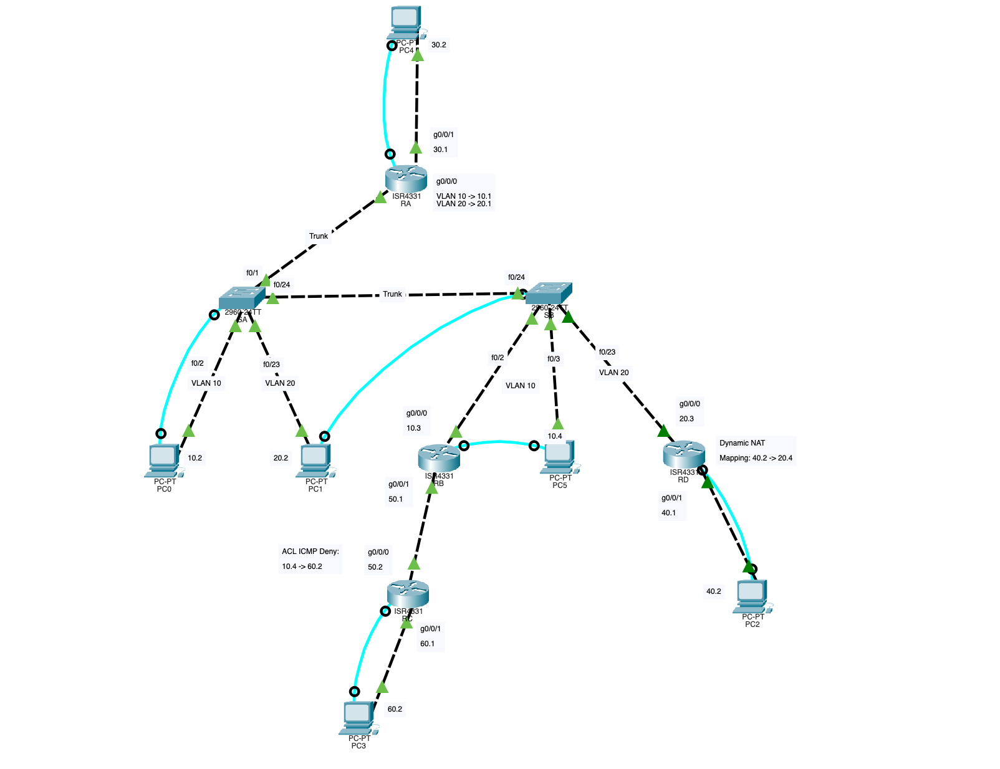
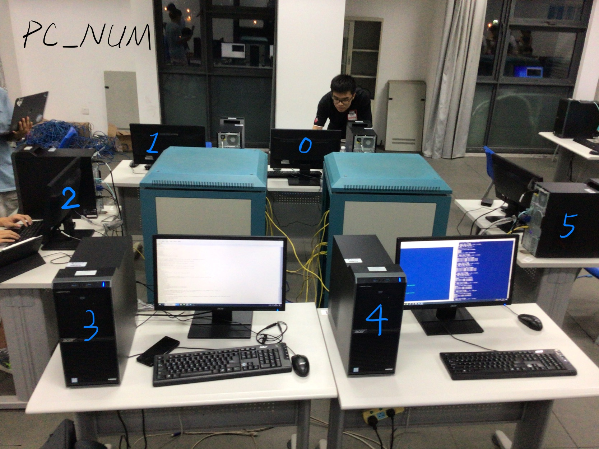
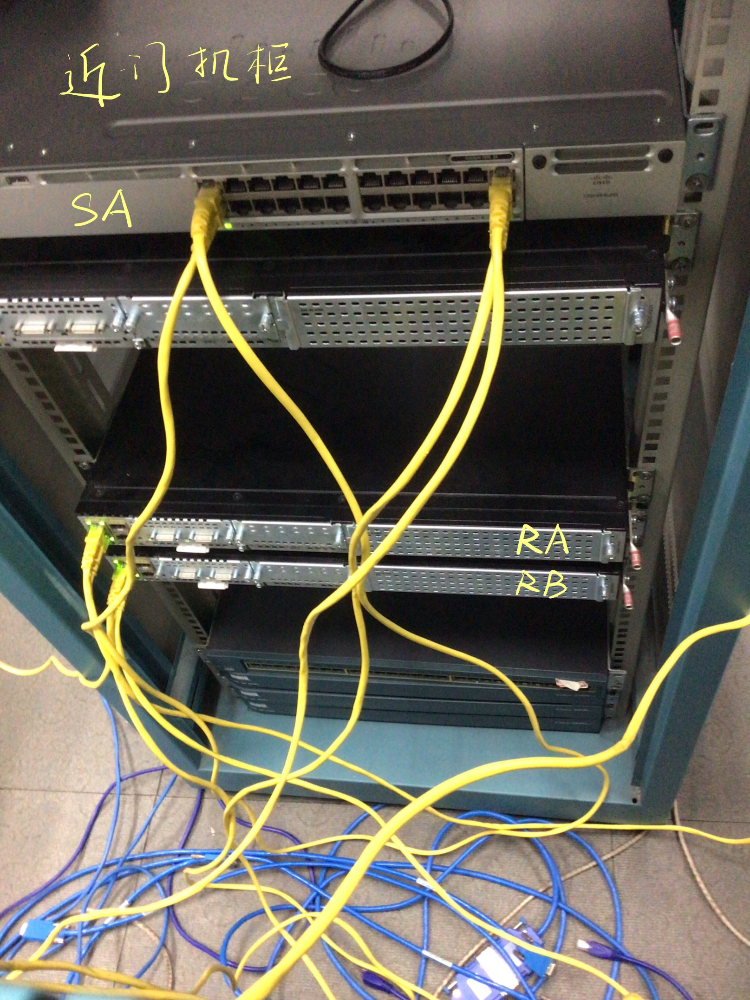
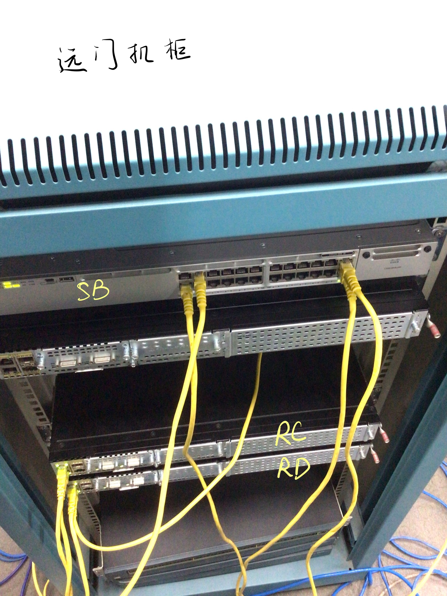
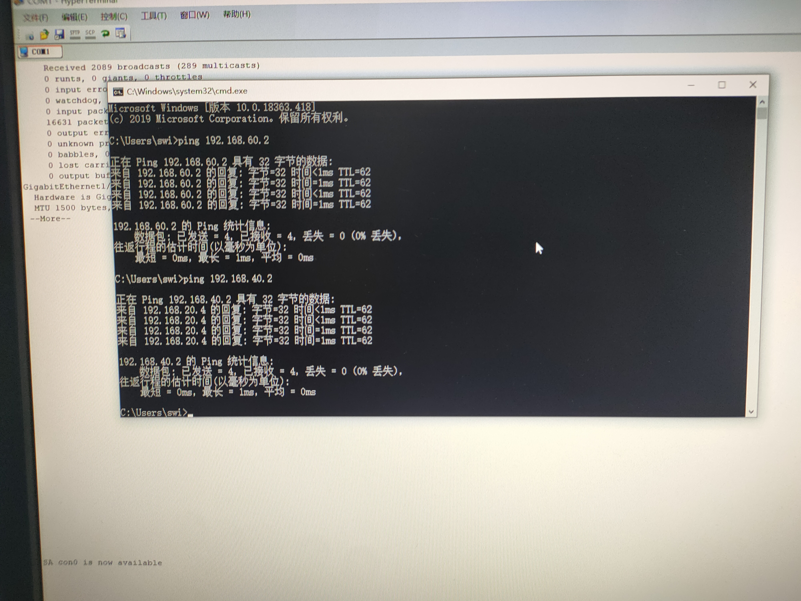
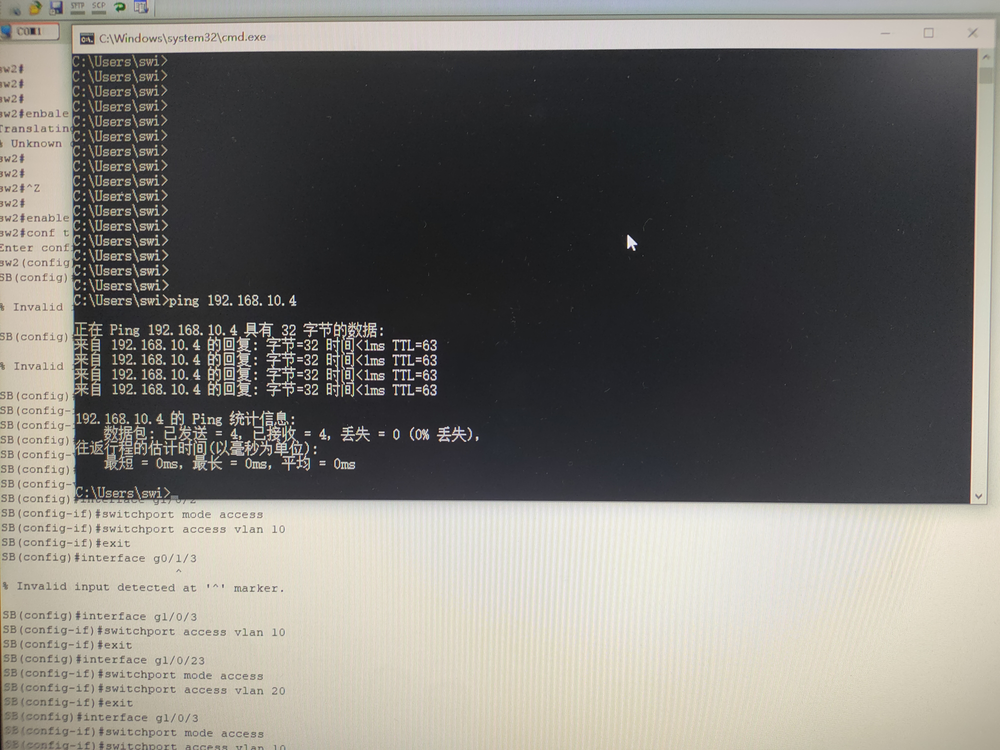
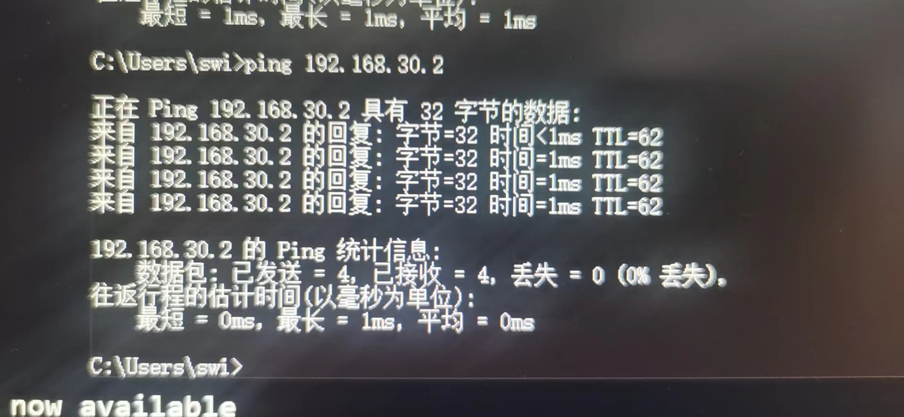
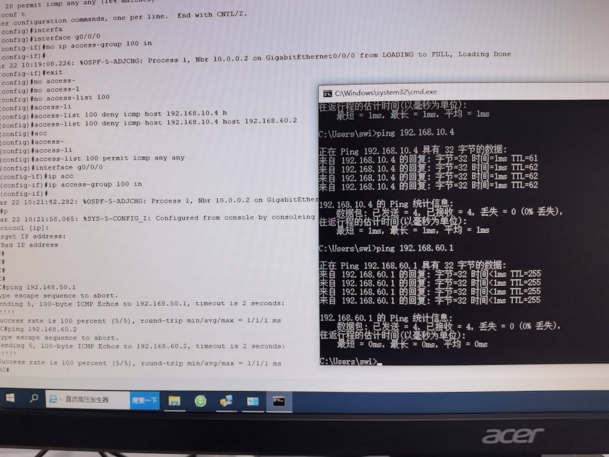
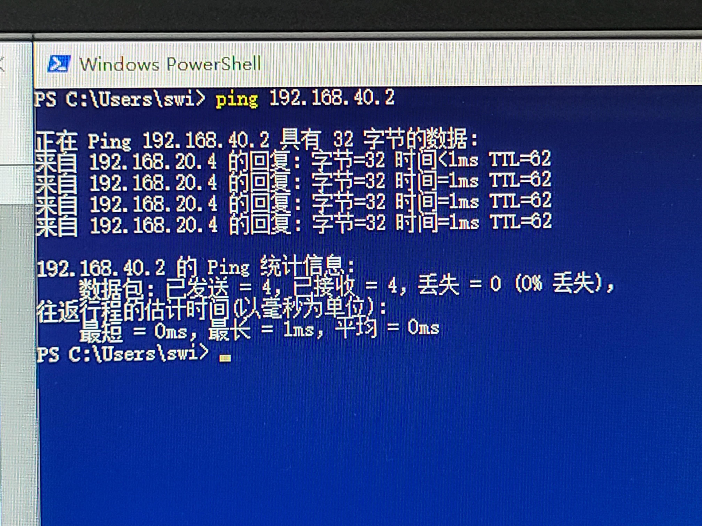
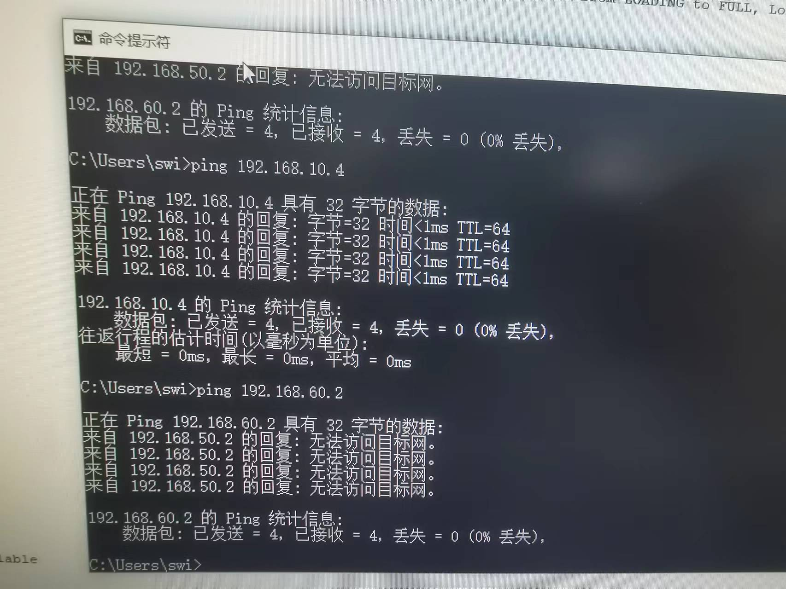

# 2022 年互联网计算实验报告

组长：谭子悦 201250093

组员：徐浩钦 201250067、陈骏 201250068、邱兴驰201250112、李佳骏201250113

## 1 实验要求

1. 使用动态路由协议
2. 包含 VLAN 及 trunk 技术
3. 至少需包含设备：2台交换机、4台路由器、4台PC
4. 60分钟内完成

## 2 实验目标

使用如下技术：

1. OSPF 动态路由协议
2. VLAN 与 Trunk 技术
3. 动态 NAT 技术
4. ACL 技术

## 3 实验内容

### 3.1 实验拓扑图



| Router | G0/0/0                                             | G0/0/1         | 备注                                             |
| ------ | -------------------------------------------------- | -------------- | ------------------------------------------------ |
| A      | VLAN10: `192.168.10.1`<br />VLAN20: `192.168.20.1` | `192.168.30.1` |                                                  |
| B      | `192.168.10.3`                                     | `192.168.50.1` |                                                  |
| C      | `192.168.50.2`                                     | `192.168.60.1` | 在 G0/0/0 上配置 in ACL deny icmp: 10.4 -> 60.2  |
| D      | `192.168.20.3`                                     | `192.168.40.1` | 配置 Dynamic NAT: 40.2 -> 20.4, G0/0/1 -> G0/0/0 |

| PC   | IPv4 Address    | IPv4 Default Gateway | Console  |
| ---- | -------------- | --- | -------- |
| 0    | `192.168.10.2` | 192.168.10.1 | Switch A |
| 1    | `192.168.20.2` | 192.168.20.1 | Switch B |
| 2    | `192.168.40.2` | 192.168.40.1 | Router D |
| 3    | `192.168.60.2` | 192.168.60.1 | Router C |
| 4    | `192.168.30.2` | 192.168.30.1 | Router A |
| 5    | `192.168.10.4` | 192.168.10.1 | Router B |

| Switch | Trunk       | Access VLAN10 | Access VLAN20 |
| ------ | ----------- | ------------- | ------------- |
| A      | G1/0/1, G1/0/24 | G1/0/2          | G1/0/23         |
| B      | G1/0/24       | G1/0/2, G1/0/3    | G1/0/23         |

### 3.3 操作概览

1. 为各 Router 与 PC 配置 IPv4地址（共 6 个子网）
2. 在 Switch A 与 Switch B 上划分两个 VLAN （10 & 20），用 Router A 连通两个子网
3. 对所有 Router 配置 OSPF
4. 在 Router D 上配置动态 NAT
5. 在 Router C 上配置 ACL

## 4 实验步骤

准备步骤：按照拓扑图连接设备

- Router 间统一采用 GigaEthernet 接口互联，而不使用 Serial 接口

详细指令见**指令参考**文档

### 4.1 命名

对各 Router / Switch 使用 `hostname $(NAME)` 重命名

### 4.2 配置各 PC 与 Router 接口的 IP 地址

- 对于 PC：手动配置其 IPv4 地址与 Default Gateway (与其直接相连的 Router 接口地址)
  - 对于与 Switch 连接的 PC，Default Gateway 选用该子网下第一个 IPv4地址（e.g.: 192.168.10.1 ）
- 对于 Router：配置各 GigaEthernet 接口的 IPv4 地址
  - 指令：
    1. `RX(config)#interface $(interface)`
    2. `RX(config-if)#ip address $(SRC) $(NETMASK)`
  - RA 用于链接 VLAN 10 与 VLAN 20，故需在其 G0/0/0 端口配置两个虚拟 IPv4 地址
    1. `RA(config)#interface g0/0/0.$(VLAN_ID)`
    2. `RA(config-subif)#encapsulation dot1Q $(VLAN_ID)`
    3. `RA(config-subif)#ip address ...`

### 4.3 配置两台 Switch 的 VLAN 分配与 Trunk Port

- 配置 Trunk Port
  1. `SA(config)#interface $(interface)`
  2. `SA(config-if)#switchport mode trunk`
- 分配 VLAN
  1. `SA(config)#vlan 10`
  2. `SA(config)#vlan 20`
  3. `SA(config)#interface $(interface)`
  4. `SA(config-if)#switchport mode access`
  5. `SA(config-if)#switchport access vlan $(VLAN_ID)`

### 4.4 在各 Router 上配置 OSPF

对于每一个 Router：

- 配置 LoopBack Interface (注意不要重复！)
  1. `RA(config)#interface lo0`
  2. `RA(config-if)#ip address 10.0.0.X 255.255.255.255`
- 配置 OSPF
  1. `RA(config)#router ospf 1`
  2. `RA(config-router)#network $(subnet) 0.0.0.255 area 0`
  - 注意不要遗漏子网（e.g.: RA 有 3 个相邻子网）

### 4.5 连通测试 1

首次 ping 可能会出现：第一次 Timeout，其余 4 次成功

- PC4 (`192.168.30.2`) <-> PC2 (`192.168.40.2`)
- PC3 (`192.168.60.2`) <-> PC0 (`192.168.10.2`)
- PC1 (`192.168.20.2`) <-> PC5 (`192.168.10.4`)

若 ping 不通，先检查 PC 的 Default Gateway 是否设置正确

### 4.6 配置 NAT

针对 Router D:

1. 设置 Access-List
   - `RD(config)#access-list 1 permit 192.168.40.0 0.0.0.255`
2. 设置 NAT Pool
   - `RD(config)#ip nat pool exam 192.168.20.4 192.168.20.4 netmask 255.255.255.0`
      - 注意：Netmask 可能有 `netmask A.B.C.D` 与 `prefix-length N` 两种语法，实际操作请输入 `?` 确认
3. 配置 NAT
   - `RD(config)#ip nat inside source list 1 pool exam`
4. 选定内外 interface
   - `RD(config-if)#ip nat inside` 
   - `RD(config-if)#ip nat outside` 

### 4.7 连通测试 2

1. 在 PC0(192.168.10.2) 上 ping PC2(192.168.40.2)，观察到 ICMP 自 192.168.20.4 返回
2. 在 RouterD 上查看 NAT 翻译表：`show ip nat translations`
   - 可能结果：
```
Pro  Inside global     Inside local       Outside local      Outside global
icmp 192.168.20.4:13   192.168.40.2:13    192.168.10.2:13    192.168.10.2:13
icmp 192.168.20.4:14   192.168.40.2:14    192.168.10.2:14    192.168.10.2:14
icmp 192.168.20.4:15   192.168.40.2:15    192.168.10.2:15    192.168.10.2:15
icmp 192.168.20.4:16   192.168.40.2:16    192.168.10.2:16    192.168.10.2:16
```

### 4.8 配置 ACL

针对 Router C：

1. 建立 ACL
   1. `RC(config)#access-list 100 deny icmp host 192.168.10.4 host 192.168.60.2`
   2. `RC(config)#access-list 100 permit icmp any any`
   3. `RC(config)#access-list 100 permit ospf any any`
2. 应用 ACL
   1. `RC(config)#interface g0/0/0`
   2. `RC(config-if)#ip access-group 100 in`

### 4.9 连通测试 3

在 PC5(192.168.10.4) 上 ping PC3(192.168.60.2)，

预期结果：


```
C:\>ping 192.168.60.2

Pinging 192.168.60.2 with 32 bytes of data:

Request timed out.
Reply from 192.168.50.2: Destination host unreachable.
Reply from 192.168.50.2: Destination host unreachable.
Reply from 192.168.50.2: Destination host unreachable.

Ping statistics for 192.168.60.2:
    Packets: Sent = 4, Received = 0, Lost = 4 (100% loss)
```


## 6 实验结果

### 6.1 设备配置

1. PC 分配


2. SA, RA, RB


3. SB, RC, RD


### 6.2 连通测试

1. PC0 (`192.168.10.2`) 连通测试 1 + 2 


2. PC1 (`192.168.20.2`) 连通测试 1


3. PC2 (`192.168.40.2`) 连通测试 1


4. PC3 (`192.168.60.2`) 连通测试 1


5. PC4 (`192.168.30.2`) 连通测试 1


6. PC5 (`192.168.10.4`) 连通测试 1 + 3


## 7 总结

实验非常成功，阿巴阿巴阿巴 // TODO